# ATIVIDADE PRÁTICA - SUBSISTEMA LINUX COM WSL
***

## Requisitos
- **Windows 10 ou superior**
- **WSL (Windows Subsystem for Linux)**
- **Ubuntu 20.04 ou superior**

***

## Objetivos

- Criar um subsistema Linux utilizando o WSL com a distribuição Ubuntu 20.04 ou superior.
- Subir um servidor Nginx, garantindo que ele esteja online e funcionando.
- Criar um script que valide se o servidor Nginx está online e envie o resultado da validação para um diretório em especifico de sua escolha.
- O script deve incluir: Data + Hora + Nome do serviço + Status + Mensagem personalizada indicando se o serviço está ONLINE ou OFFLINE.
- O script deve gerar dois arquivos de saída: um para o serviço online e outro para o serviço offline.
- Automatizar a execução do script a cada 5 minutos.
- Realizar o versionamento da atividade no GitHub.
- Documentar o processo de instalação do Linux, a configuração do servidor Nginx e o processo de automação.

***
## ÍNDICE

1. [Ativação do WSL](#ativação-do-wsl)
2. [Instalação do Ubuntu 20.04 ou superior](#instalação-do-ubuntu-2004-ou-superior)
3. [Subir um servidor Nginx no Ubuntu](#subir-um-servidor-nginx)
4. [Criação do Script de Verificação de Status](#criação-do-script-de-verificação-de-status)
5. [Automatização da Execução do Script](#automatização-da-execução-do-script)
6. [Versionamento e Documentação](#versionamento-e-documentação)

***
***
 # 1. Ativação do WSL

Para ativar o Windows Subsystem for Linux (WSL) no Windows, você pode seguir os seguintes passos:

### Opção 1: Usando o PowerShell (Método Recomendado)
1. Abra o **PowerShell** com permissões de administrador e execute o comando:

```bash
wsl --install
````

    
Este comando irá instalar automaticamente o WSL e os componentes necessários. Após a instalação, o Ubuntu será iniciado automaticamente.

***

### Opção 2: Ativação Manual dos Recursos no Painel de Controle

 Caso queira ativar o WSL manualmente ou se a opção do PowerShell não funcionar corretamente, siga os passos abaixo:

1. Abra o **Painel de Controle**.
2. Selecione **Programas**.
3. Clique em **Ativar ou desativar recursos do Windows**.
4. Na **lista de recursos**, marque as opções:
      - Hyper-V
      - Plataforma de Máquina Virtual
      - Subsistema do Windows para Linux

5. Clique em **OK** para aplicar as mudanças. O sistema pode pedir para reiniciar o computador.
6. Após o reinício, vá até a **Windows Store** e baixe o **Ubuntu 20.04** ou superior.

***

# 2. Instalação do Ubuntu 20.04 ou superior
### Configuração do Ubuntu
Após a instalação do Ubuntu, vá até o Menu Iniciar e procure por Ubuntu. Clique para abrir o aplicativo.  
Na primeira vez que o Ubuntu for aberto, ele solicitará a criação de um usuário e senha.  
Isso é necessário para além do usuário root, que já existe no sistema.


***
### Testando a Configuração
Após a instalação e configuração do Ubuntu, você pode usar alguns comandos para verificar o funcionamento do sistema como:  

 Exibe o nome do usuário atualmente logado no sistema.
```bash
whoami
````
 Exibe o nome do host da máquina, útil para identificar o computador na rede.
```bash
hostname
````


 Exibe informações detalhadas sobre o sistema operacional, como o kernel e a versão do Ubuntu em uso.
```bash
uname -a
````
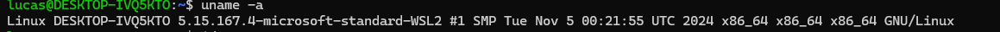

Exibe o nome do usuário atual.
 ```bash
id -un
````


Exibe o nome do usuário configurado no sistema.
```bash
echo $USER
````
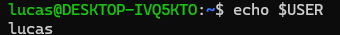


***
***

# 3. Subir um servidor Nginx
Agora que o Ubuntu está configurado corretamente, podemos proceder com a instalação e configuração do servidor Nginx no Ubuntu.

### Passo 1: Atualizar o sistema e instalar o Nginx

- Comando para atualizar o sistema:
 ```bash
sudo apt update && sudo apt upgrade -y
````
- Comando para instalar o Nginx:
 ```bash
sudo apt install nginx -y
````


### Passo 2: Iniciar o serviço do Nginx
Para iniciar o Nginx, use o comando:
 ```bash
sudo systemctl start nginx
````
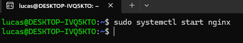

### Passo 3: Habilitar o Nginx para iniciar com o sistema
Para garantir que o Nginx inicie automaticamente após um reinício do sistema, use o comando:
 ```bash
sudo systemctl enable nginx
````
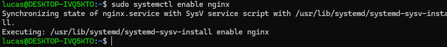

### Passo 4: Verificar se o servidor está rodando
Para verificar o status do servidor Nginx, use o comando:
 ```bash
systemctl status nginx
````
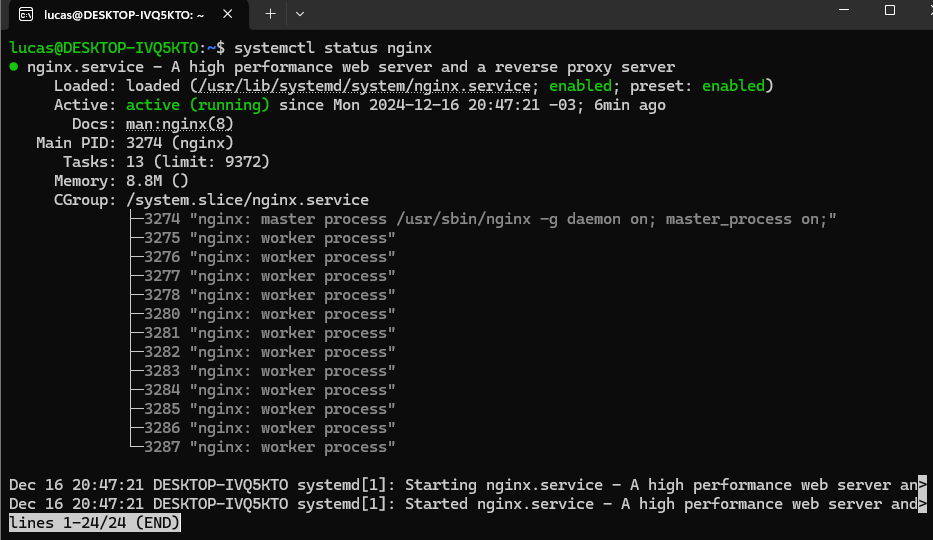

***Observação:*** O Nginx deve estar rodando e disponível no endereço http://localhost ou no IP do sistema.

Com o Nginx rodando no terminal, abra o navegador e acesse http://localhost. Se estiver rodando em uma máquina virtual, substitua localhost pelo IP da máquina.

### Comandos básicos para gerenciar o Nginx:

| Comando                             | Função                                      |
|-------------------------------------|---------------------------------------------|
| `sudo systemctl disable nginx`      | Desabilita o serviço Nginx no boot.         |
| `sudo systemctl enable nginx`       | Habilita o serviço Nginx no boot.           |
| `sudo systemctl stop nginx`         | Para o serviço Nginx.                       |
| `sudo systemctl start nginx`        | Inicia o serviço Nginx.                     |
| `sudo systemctl restart nginx`      | Reinicia o serviço Nginx.                   |
| `sudo systemctl reload nginx`       | Recarrega as configurações sem reiniciar.   |  

- **Informação**

    - Acesse o diretório onde as páginas web estão armazenadas:  
     ```bash
        cd /var/www/html
     ````

    - Verifique os arquivos na pasta:
       ```bash
        ls
       ````

     **verá o arquivo index.nginx-debian.html, que é a página inicial padrão do Nginx.**


### Passo 5: Acessar a página de boas-vindas do Nginx

Se tudo estiver funcionando corretamente, você verá a página de boas-vindas do Nginx com a mensagem *"Welcome to Nginx!"*.


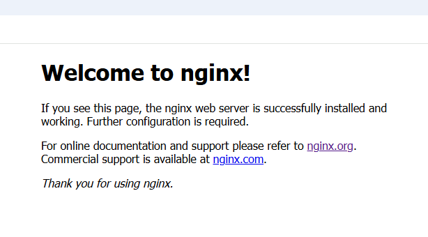

- **Agora que você configurou o servidor Nginx, pode seguir para a criação do script de verificação de status.**

***
***
# 4. Criação do Script de Verificação de Status
**Informação:** Onde colocar o script? Ele pode ser colocado em qualquer diretório de sua escolha, mas há algumas convenções para o local dos scripts no Linux:

Scripts pessoais de usuário: Normalmente ficam em /home/usuario.
Scripts de sistema: Normalmente ficam em /usr/local/bin ou /opt/.
Se o script for algo mais global, pode ser colocado em qualquer um dos dois primeiros diretórios.

### Passo 1: Criar um diretório de scripts.
Para organizar os arquivos, crie um diretório com o comando:
 ```bash
mkdir scripts
````


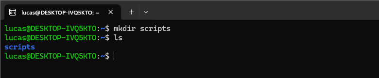
### Passo 2: Navegar até o diretório criado.
Use o comando a seguir para acessar o diretório:
 ```bash
cd ~/scripts
````


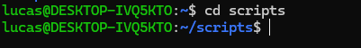  

**Observação:** Agora, dentro do diretório scripts, você está pronto para criar o arquivo de shell script de verificação.


### Passo 3: Criar o arquivo usando o editor Nano.
No terminal, utilize o comando:
 ```bash
nano valida_nginx.sh
````


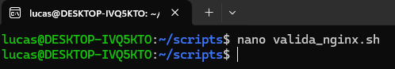  

**Observação:** O sufixo .sh não é obrigatório, mas é uma convenção amplamente utilizada para indicar que o arquivo se trata de um shell script. Isso facilita a identificação e é considerado uma boa prática.

### Passo 4: Escrever o script de validação.
Com o arquivo aberto para edição, crie um script que valide (verifique) se o serviço está online. O script deve enviar o resultado dessa validação para um diretório que você definir.
                                                 
   **A Estrutura do script deve incluir:**  
- Data e hora;
- Nome do serviço;
- Status (online ou offline);
- Mensagem personalizada, informando se o serviço está online ou offline.

**Observação:** O script deve gerar dois arquivos de saída:

- Um arquivo para registrar quando o **serviço está online**;
- Outro arquivo para registrar quando o **serviço está offline**.

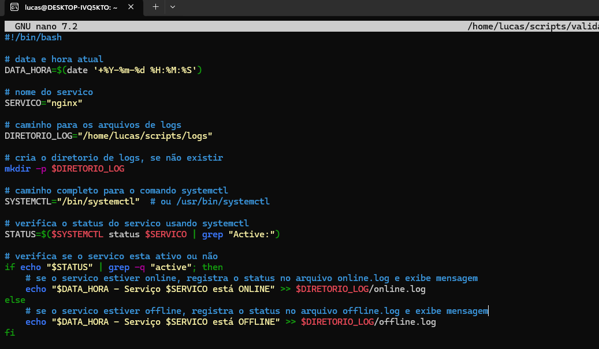  

### Passo 4:  Testar manualmente o script valida_nginx.sh criado.
  -  Certifique-se de que o script tem permissão para ser executado:  
  
  

 ```bash
chmod +x ~/scripts/valida_nginx.sh
````
  - Executar o Script.

 ```bash
./valida_nginx.sh

````  
  - Verificar os Logs.
    
     ***O script grava dois tipos de logs: online.log e offline.log.***
    
      Para verificar qual log foi atualizado:
      Se o Nginx estiver online, o log online.log deverá conter algo como:

      ```bash
            tail ~/scripts/logs/online.log

     ````


    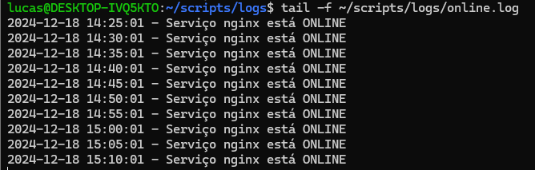  


       Se o Nginx estiver offline, o log offline.log


       ```bash
       tail ~/scripts/logs/offline.log

       ````   


    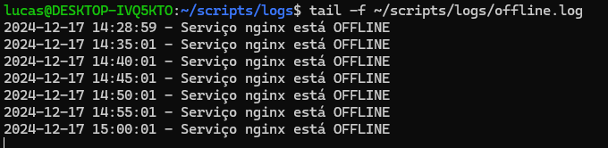  

**Observação:** Aqui já podemos ver que o cron está configurado automaticamente para executar o script a cada 5 minutos, atualizando ambos os logs: online.log e offline.log, dependendo do status do serviço.


***


# 5. Automatização da Execução do Script

Configure a execução automatizada do script a cada **5 minutos**. Para isso, utilize o **cron**.

## Configuração do cron
Segue o passo a passo para configurar o cron:

- Use este comando para editar o arquivo do crontab
 ```bash
crontab -e
````


- Adicione a seguinte linha ao final do arquivo para agendar o script

 ```bash
*/5 * * * * /caminho/para/o/script/valida_nginx.sh
````

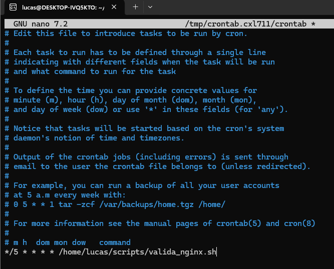

- Salve e saia do editor.
    - Pressione Ctrl+O para abrir a opção de salvar.
    - Confirme o nome do arquivo pressionando Enter.
    - Pressione Ctrl+X para fechar o editor.

- Para verificar se a configuração foi aplicada corretamente, use este comando:

 ```bash
crontab -l
````


Isso mostrara a lista de tarefas agendadas no cron para o usuário atual.  

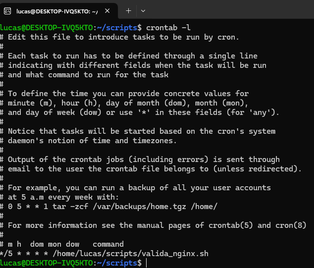


